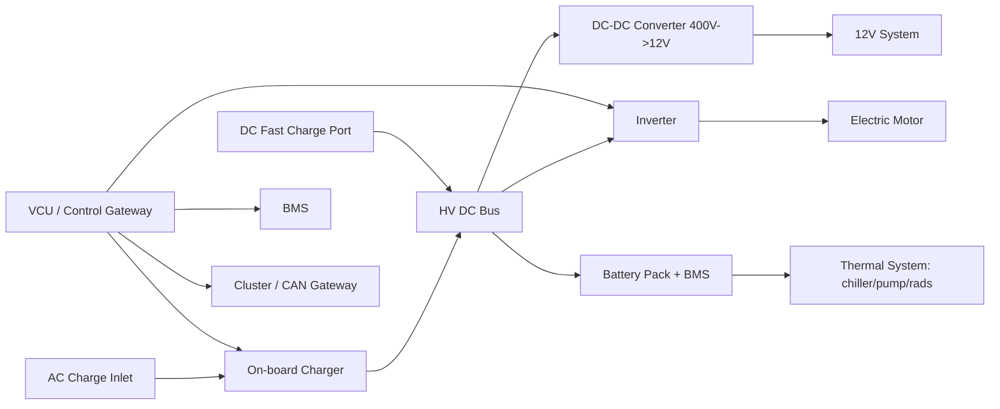
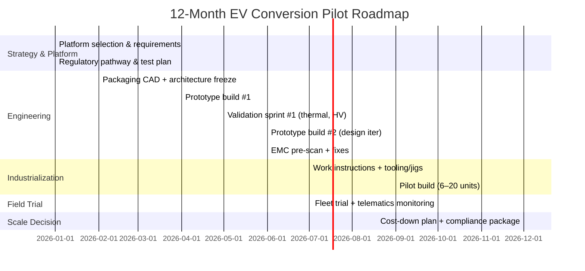

```markdown
<!-- Filename: automotive_conversion_roadmap.md -->

# Automotive Conversion Roadmap (ICE → BEV)  
*A practical, engineering-led and commercially grounded playbook for launching an EV conversion program—covering market sizing, technical architecture choices, regulatory pathways, unit economics, and a 12‑month pilot plan.*

---

## Table of Contents
1. [Executive Summary](#executive-summary)  
2. [Market Analysis](#market-analysis)  
3. [Technical Comparison](#technical-comparison)  
4. [Conversion Process & Engineering Playbook](#conversion-process--engineering-playbook)  
5. [Business Model & Costing](#business-model--costing)  
6. [Supply Chain & Vendors](#supply-chain--vendors)  
7. [Regulatory & Safety Compliance](#regulatory--safety-compliance)  
8. [Case Studies (Conversions & OEM Upgrades)](#case-studies-conversions--oem-upgrades)  
9. [12-Month Pilot Roadmap and KPIs](#12-month-pilot-roadmap-and-kpis)  
10. [Appendices (Datasets, Spreadsheets, References)](#appendices-datasets-spreadsheets-references)

---

## Executive Summary

Electrifying existing internal-combustion vehicles through conversion (retrofit) can be commercially viable in specific segments—especially where vehicles have long remaining service life, high utilization, urban duty cycles, or sentimental/heritage value. Conversions can also reduce lifecycle emissions by extending the life of an existing chassis and avoiding some manufacturing emissions associated with a new vehicle (benefits vary heavily with use profile and electricity mix). However, conversions are constrained by (1) labor intensity and engineering repeatability, (2) battery supply and certification burdens, (3) regulatory approval complexity by jurisdiction, and (4) customer expectations around warranty, reliability, and service support.

This roadmap proposes a **12-month pilot** focused on one platform (or a tight family of platforms) to achieve repeatability, cost-down, and compliance maturity. The highest-probability path to product-market fit typically targets:

- **Light commercial vehicles (LCVs)/vans in urban fleets** (predictable routes, depot charging, high fuel and maintenance savings, strong policy tailwinds).
- **Classic/collector vehicles** (premium pricing, lower annual mileage, customers value drivability and preservation).
- **Specialty/off-road/industrial platforms** (airports, ports, campuses, municipalities) where emissions and noise restrictions matter and speeds are modest.

A conversion program must be run like a small OEM: defined architecture, controlled bill of materials (BOM), documented manufacturing process, functional safety approach, EMC discipline, end-of-line (EOL) testing, and a traceable service strategy.

**Key recommendations:**
1. **Choose one “hero platform”** for the pilot with high unit volume potential (e.g., a common van model year range) and engineer a standardized kit architecture (mounts, HV loom, cooling, software integration).
2. **Adopt an HV safety and compliance-by-design approach** aligned to UNECE R100 (battery safety), UNECE R10 (EMC), and local approval routes (e.g., UK IVA; EU national approvals; US state-based pathways).  
3. **Design for serviceability**: sealed and modular HV system, diagnostic access, standardized connectors, clear isolation points, training materials, and a warranty posture.
4. **Build unit economics around repeatable labor hours** (targeting a steep learning curve from prototype → pilot → low-rate production).
5. **Use a phased validation strategy**: subsystem bench tests, dyno/road tests, thermal characterization, charging interoperability, and controlled fleet trials.

---

## Market Analysis

### 1) Macro drivers and why conversions exist alongside new EVs
While new EV adoption continues to grow globally, a conversion market persists because:

- **Fleet replacement cycles can be slow**, and some fleets have “stranded” ICE assets with long remaining life.
- **New EV supply constraints** (availability, lead times, upfit constraints) can delay electrification.
- **Specific body configurations** (special service bodies, accessibility conversions, bespoke interiors) are expensive to replace.
- **Policy and low-emission zones** create localized urgency for electrification.
- **Customer preference** for preserving classic vehicles while improving drivability and reliability supports premium conversions.

Relevant public context:
- Battery costs have fallen dramatically over the past decade, enabling more feasible retrofits, though pack integration and compliance remain challenging (see IEA battery and EV outlook reporting) [IEA – Global EV Outlook](https://www.iea.org/reports/global-ev-outlook-2024).
- Policy pressure (e.g., city LEZ/ULEZ-style zones, fleet emissions mandates) increases demand for compliant urban vehicles.

### 2) Addressable segments (practical TAM/SAM lens)
Instead of attempting a single “global TAM,” conversions are best analyzed as *segment SAMs* where conversion beats alternatives.

**A. Urban commercial vans (highest near-term scalability)**
- Fleet operators care about TCO, uptime, depot charging, and regulatory access.
- Repeatable platforms (common chassis) enable kit standardization.
- Strong fit for “return-to-base” duty cycles.

**B. Municipal/specialty vehicles**
- Street sweepers, utility service trucks (light duty), campus shuttles, airport vehicles.
- Often lower speed and predictable duty.
- Procurement can value noise reduction and local air quality.

**C. Classic and performance restomods (premium pricing)**
- Customers pay for craftsmanship and brand storytelling.
- Volumes smaller; engineering still demanding but regulatory bar can vary depending on use and jurisdiction.

**D. Developing market retrofits**
- Potentially large, but faces constraints: enforcement uncertainty, safety risk, informal supply chain, inconsistent standards.

### 3) Competitive landscape
Competitors typically fall into:
- **High-end restomod firms** (bespoke builds, high margins, low volume).
- **Fleet retrofit specialists** (platform-focused, process-driven).
- **Kit suppliers** (sell components; integrators do the install).
- **OEM and Tier-1 upfit ecosystems** (official electrified platforms or certified conversions).

**Strategic differentiation options:**
- Platform repeatability and short lead times.
- Compliance maturity and documented safety case.
- Superior thermal management and charging interoperability.
- Warranty + service network.
- Data/telematics and fleet energy optimization.

---

## Technical Comparison

### 1) Conversion vs purchasing a new EV (decision matrix)

| Dimension | ICE→BEV Conversion | Buy New/Used OEM EV | Notes |
|---|---:|---:|---|
| Capex | Medium–High (labor + battery) | High (new EV), Medium (used EV) | Conversions can be cost-competitive when chassis is “free” (already owned) |
| Lead time | Potentially shorter if kit + supply chain ready | Varies; can be long for certain models/upfits | Fleet availability often drives interest in retrofits |
| Warranty/Support | Must be created by converter | OEM standard | Conversions need strong service strategy |
| Range/efficiency | Depends on packaging and aero | Typically better | OEMs optimize mass, aero, controls |
| Safety compliance | Must be engineered and evidenced | OEM validated | R100/R10/functional safety burden is real |
| Residual value | Uncertain/segmented | More predictable | Requires market education and documentation |
| Integration quality | Variable (great to poor) | High | Conversions must avoid “prototype forever” trap |

### 2) Architecture choices for conversions

**A. “Crate” electric drive unit + custom integration**
- Pros: flexibility, potentially high performance.
- Cons: higher integration effort (controls, mounting, cooling, NVH).

**B. Salvage/repurposed OEM EV components (motor/inverter/battery)**
- Pros: cost advantage, proven components.
- Cons: uncertain history, warranty risk, software integration challenges, certification complexity, and availability variability.

**C. New Tier‑1/Tier‑2 components (motor/inverter/pack modules)**
- Pros: traceability, support, better for compliance and scaling.
- Cons: higher BOM cost.

**Battery pack strategy options**
- **Pack-as-a-product**: purchase certified pack from supplier. Easiest path for safety evidence, but packaging constraints.
- **Module-based custom pack**: best packaging; increases engineering and compliance testing burden (thermal, mechanical, electrical, BMS).
- **Hybrid**: standardized pack family with configurable module count.

### 3) Recommended reference design (pilot-friendly)

A pilot program benefits from a conservative, repeatable architecture:

- **400V class HV system** (widely supported; good component availability).  
- **AC charging (Type 1/J1772 or Type 2) as baseline**, DC fast charging optional if duty requires it (and if compliance and thermal headroom support it).  
- **Liquid-cooled battery and inverter** for commercial duty; air cooling can work for low-power classics but must be validated in hot soak/traffic.  
- **Standards-based HV safety**: HVIL loop, pyro-fuse or contactor strategy, insulation monitoring device (IMD) where appropriate, service disconnect, clear labeling and interlocks.

**Illustrative system block diagram (reference)**



---

## Conversion Process & Engineering Playbook

### 1) Gate-based product development lifecycle (convert like an OEM)

**Gate 0 – Feasibility**
- Define vehicle platform(s), duty cycle, target range, payload, gradeability, top speed, charging needs.
- Packaging study (battery volume, axle loads, crash zones).
- Regulatory pathway assessment by target market.
- Business case: BOM + labor + overhead vs price and volume.

**Gate 1 – Prototype Design Freeze**
- CAD design for mounts, battery enclosure, cooling loops.
- Electrical architecture: HV junction box, fusing, contactors, HVIL, service disconnect.
- Control plan: VCU strategy, CAN integration, limp modes.
- Safety analysis: hazard analysis + initial DFMEA/PFMEA.

**Gate 2 – Prototype Build & Validation**
- Bench test subsystems (inverter+motor, OBC, DC-DC, thermal).
- HV insulation, leakage, IMD behavior.
- Road testing with structured test plan.

**Gate 3 – Pilot Production Readiness**
- Work instructions, torque specs, QC checklists.
- End-of-line test station and data capture.
- Supplier quality plan; component traceability and serialization.

**Gate 4 – Low-rate Production + Field Feedback**
- Fleet trial, telematics, failure tracking, containment actions.
- Design revisions and cost-down.

### 2) Detailed engineering steps (practical checklist)

#### A. Vehicle selection and incoming inspection
- Rust, structural condition, crash history, brake and suspension baseline.
- Weigh vehicle; measure axle loads.
- Document VIN/variant, ECU versions, immobilizer considerations.
- Baseline fuel economy and performance data (for TCO comparisons).

#### B. Performance and energy requirements
Define targets with explicit test conditions:
- Range at specified speed/temperature/payload.
- 0–60 mph (or 0–50 km/h) if needed.
- Gradeability (e.g., 12% at GVW).
- Thermal limits: sustained power at ambient 40°C, stop-and-go.

#### C. Powertrain sizing (rules of thumb)
- **Energy consumption** for vans often ~250–400 Wh/mi (155–250 Wh/km) depending on mass/aero/speed; classics can be lower if lighter but vary widely. Use empirical drive cycle measurement early.
- **Battery usable energy** should include reserve (e.g., 10–15%) and degradation buffer for warranty period.

#### D. Mechanical integration
- Motor mounting and alignment; consider driveshaft angles and CV joint limits.
- Battery enclosure design: ingress protection targets (often IP67 aspiration), venting strategy, service access.
- Maintain crash structure integrity; avoid placing packs in crush zones without appropriate engineering evidence.
- Suspension upgrades (springs/dampers) to manage mass distribution changes.

#### E. Thermal management
- Define cooling loops: battery loop, power electronics loop, cabin HVAC integration.
- Validate hot soak, heat rejection at sustained load, and cold temperature charging limits.
- If using DC fast charge, thermal headroom becomes a primary design constraint.

#### F. Electrical & HV safety
- HVIL loop continuity checks.
- Contactor pre-charge strategy to protect capacitors and reduce inrush.
- Cable routing: abrasion protection, bend radius, separation from LV, grommets through bulkheads.
- Proper HV labeling, orange cabling conventions, and service disconnect location.

#### G. Controls and software integration
- VCU mapping: torque request, regen blending, traction control considerations.
- Brake blending: if retaining hydraulic brakes only, ensure stable regen cut-out and pedal feel.
- Instrumentation: SOC estimation, warnings, limp mode indicators.
- Diagnostics: store fault codes; provide service tool access; log HV events.

#### H. Charging interoperability
- AC charging: pilot signal handling per IEC 61851 / SAE J1772 basics (jurisdiction dependent).
- Validate across multiple EVSE brands and line conditions.
- Ground-fault and isolation monitoring behavior should be consistent and safe.

#### I. Testing and validation plan (minimum viable validation)
- Electrical: insulation resistance, dielectric withstand where applicable, HVIL, IMD.
- Thermal: battery and inverter temps under worst-case conditions.
- Drivability: creep, regen behavior, stall prevention.
- Durability: vibration checks, connector retention, thermal cycling.
- EMC pre-scan: mitigate before formal test labs.

**End-of-line (EOL) test (example)**
- HV insulation test pass/fail threshold
- CAN network health
- Contactor function & pre-charge timing
- DC-DC output stability
- Charger handshake
- Short road test with data logging

---

## Business Model & Costing

### 1) Business models (choose intentionally)

**Model 1: Full-service conversion (turnkey)**
- You supply parts + labor + warranty.
- Best control of quality and brand.
- Requires facilities, technicians, QA, and support.

**Model 2: Certified installer network**
- Central engineering + parts supply; regional installers perform labor.
- Scales faster geographically, but quality control is harder.
- Requires training, audits, and standardized EOL tests.

**Model 3: Component/kit supplier**
- Lower liability and capital intensity.
- Lower margin; depends on partners for integration quality.

**Model 4: Fleet electrification-as-a-service**
- Bundle conversion + financing + maintenance + charging + telematics.
- Attractive for fleets; more complex but sticky recurring revenue.

### 2) Cost structure and key sensitivities

**Primary cost drivers**
- Battery pack $/kWh and certification needs.
- Labor hours (mechanical + electrical + validation).
- Rework and troubleshooting time (dominant early in program).
- Warranty reserve (must be priced in).

**Illustrative BOM ranges (pilot-scale, 400V, ~50–70 kWh usable)**  
*(Non-binding indicative ranges; actual costs vary by volume, supplier, and spec.)*

| Subsystem | Typical Cost Range (USD) | Notes |
|---|---:|---|
| Battery pack (50–70 kWh) | $9,000–$20,000 | New modules + BMS + enclosure drives cost |
| Motor + inverter | $4,000–$12,000 | Power rating, cooling, supplier |
| On-board charger (6–11 kW) | $800–$2,500 | Higher power and approvals increase cost |
| DC-DC converter | $300–$1,200 | 12V system loads matter |
| HV junction box, contactors, fuses, HVIL | $600–$2,000 | Safety components and enclosure quality |
| Thermal (pumps, rads, hoses, chiller optional) | $700–$3,500 | DCFC and heavy duty require more |
| Wiring harnesses/connectors | $400–$2,000 | Custom looms add labor and variability |
| Mounts, fabrication, battery enclosure | $800–$6,000 | Depends on repeatability and tooling |
| Controls (VCU, CAN gateway, software) | $500–$4,000 | Development amortization not included |
| Instrumentation/display | $200–$1,500 | Cluster integration is often underestimated |

**Labor (typical early-stage)**
- Prototype builds: **250–500 hours** per vehicle is common when engineering is evolving.
- Pilot repeatable builds: target **120–220 hours** with standardized kit, jigs, and work instructions.
- Mature low-rate production: some programs reach **60–120 hours**, depending on complexity and platform access.

### 3) Pricing and margin approach
A viable pricing model typically includes:
- Direct BOM + direct labor  
- Overhead allocation (facility, engineering, QA)  
- Warranty reserve (explicit line item)  
- Margin to fund improvements and support

**Example (illustrative)**
- Direct BOM: $22,000  
- Direct labor: 160 hrs × $95/hr loaded = $15,200  
- Overhead allocation: $4,000  
- Warranty reserve: $2,500  
- Total cost: $43,700  
- Price (25% gross margin target): ≈ $58,000

This is often competitive for specialized vans already owned by fleets—especially when the alternative is buying a new EV van plus body upfit and downtime.

---

## Supply Chain & Vendors

A conversion program should maintain an approved vendor list (AVL) and define which components must be:
- Automotive-grade (AEC-Q where applicable for electronics)
- Certified (battery safety, chargers)
- Traceable (serial number, lot control)

### 1) Component categories and vendor selection criteria
**Selection criteria**
- Technical documentation quality (ICDs, pinouts, CAN DBCs)
- Support responsiveness
- Proven field reliability
- Lead times and minimum order quantities
- Availability of test reports (UN 38.3 for cell transport, EMC pre-compliance data, etc.)
- Warranty terms

### 2) Vendor shortlist (examples—non-exhaustive)
*(These are examples of known market participants; final sourcing should be validated for your region, volumes, and compliance needs.)*

- Motors/inverters: BorgWarner, Bosch, Dana, Cascadia Motion, EMRAX (motor), Equipmake (some applications)
- Chargers: BRUSA (historically), Delta, Valeo (OEM), various automotive-grade suppliers
- Battery cells/modules: CATL, LG Energy Solution, Panasonic, Samsung SDI (typically via integrators or authorized channels)
- BMS: Orion BMS (common in conversions), Eberspächer/BorgWarner (OEM-grade), Lithium Balance (EU)
- Contactors/fusing: TE Connectivity, Eaton, Littelfuse
- Connectors/HV cable: TE, Amphenol, HUBER+SUHNER
- Thermal components: Pierburg, Bosch, Davies Craig (application dependent)
- Telematics: Geotab ecosystem, OEM-agnostic telematics vendors

### 3) Supply chain risk controls
- Dual-source where possible (contactors, connectors, pumps).
- Incoming QC: insulation resistance spot checks, connector retention checks, serialization capture.
- Battery: strict handling SOPs (storage SOC, temperature, damage inspection), quarantine process.

---

## Regulatory & Safety Compliance

**Important:** Requirements vary sharply by jurisdiction and vehicle class. The goal of this section is to outline a compliance strategy and the most common standards encountered—not legal advice.

### 1) Core safety principles for conversions
- Treat the converted vehicle as a high-voltage product with credible hazards.
- Implement a safety lifecycle: hazard analysis → safety requirements → design controls → validation → production controls → field monitoring.
- Document everything: design intent, test evidence, and build traceability.

### 2) Commonly referenced standards and regulations
**Electrical safety / battery**
- **UNECE R100** – electric powertrain safety (widely referenced internationally).
- **UN 38.3** – lithium battery transport testing (shipping compliance).
- **UL 2580** – batteries for EVs (common in North America, depending on product pathway).

**EMC**
- **UNECE R10** – electromagnetic compatibility (vehicle-level EMC).

**Functional safety (process framework)**
- **ISO 26262** – functional safety for road vehicles (often applied proportionally in conversions).
- **ISO 21434** – cybersecurity engineering (relevant when adding connectivity/telematics).

**Charging interfaces**
- **IEC 61851** (EV conductive charging system)
- **SAE J1772** (North American AC charging interface)
- **CCS/ISO 15118** (DC charging communication, where used)

### 3) Approval pathways (high-level)
- **UK:** Individual Vehicle Approval (IVA) may apply depending on extent of modification and vehicle category; consult DVSA guidance and specialist test houses early.
- **EU:** Approval is often handled at national level for modified vehicles; requirements vary; engage a homologation consultant.
- **US:** Rules can be state-based for registration; federal safety standards (FMVSS) apply to manufacturers, and modifiers must avoid rendering safety features inoperative. Engage counsel and a test lab for critical safety claims.

### 4) Compliance matrix (what to plan and evidence)

| Area | Design Controls | Evidence/Artifacts |
|---|---|---|
| HV shock protection | HVIL, insulation, IP-rated enclosures, orange cabling | Insulation test reports, assembly inspection, service procedures |
| Battery safety | Containment, venting, thermal strategy, fusing | Thermal test results, abuse considerations, supplier test reports |
| Crashworthiness | Maintain structural members; safe pack placement | Engineering assessment, documentation, potentially crash analysis |
| EMC | Shielding, grounding, harness routing, filtering | EMC pre-scan results; final lab test if required |
| Braking | Regen strategy; brake bias; fail-safe behavior | Brake tests, stability evaluation, customer acceptance |
| Fire risk | Material selection; isolation; detection | SOPs, risk assessment, emergency response guide |
| Service safety | Lockout/tagout, PPE, training | Technician training logs, service manual, rescue sheet |

### 5) Workshop and field safety requirements
- HV technician training tiers (awareness → service → diagnosis).
- PPE and tools: CAT III/IV meters, insulated tools, HV gloves, face shield.
- Emergency response documentation: first responder guide, battery location diagrams, disconnect procedure.

---

## Case Studies (Conversions & OEM Upgrades)

This section highlights patterns rather than endorsing any single product.

### Case Study 1: Premium classic conversion (“restomod” model)
**Pattern:** High willingness to pay, low annual mileage, strong brand experience focus.  
**Typical approach:** Custom pack in available cavities, refined NVH, curated UI, modern HVAC.  
**Risks:** One-off engineering costs, long build times, inconsistent documentation if not systematized.  
**What works:** Tight configuration control—limit options; create a platform “kit” even for classics (standard pack modules, standard harness).

### Case Study 2: Fleet van retrofit (repeatable kit model)
**Pattern:** Fleet operator wants predictable TCO, uptime, and depot charging integration.  
**Typical approach:** Standard motor/inverter, robust liquid thermal, conservative SOC windows, telematics.  
**Risks:** Payload and axle load constraints; poor packaging can reduce usability; downtime kills ROI.  
**What works:** Build jigs/fixtures, enforce standardized harness routing, and design for fast service swaps (pumps, contactors, DC‑DC).

### Case Study 3: OEM-style upgrades (battery refresh / module replacement concept)
**Pattern:** Extending life of electrified platforms by replacing degraded modules or packs.  
**Value:** Lower cost than replacing whole vehicle; sustainability narrative; faster turnaround.  
**Risks:** Warranty complexity, matching old and new chemistries, software calibration, thermal mismatch.  
**What works:** Use validated pack families, maintain traceability, and test capacity/IR of modules to balance packs.

### Case Study 4: Repurposed OEM EV drivetrain into ICE chassis
**Pattern:** Salvage or donor EV parts reduce BOM cost.  
**Risks:** Unknown part history, immobilizer/software lock-in, inconsistent availability, and difficult compliance claims.  
**What works:** Limit to pilot experimentation or hobbyist builds unless you can secure consistent donor supply and robust test/QA gates.

---

## 12-Month Pilot Roadmap and KPIs

### Pilot objective
Deliver a **repeatable, compliant, serviceable conversion package** for one target platform, proven in a small fleet trial, with clear cost and quality metrics enabling scale decisions.

### Assumptions (edit for your context)
- Target platform: one common van/SUV platform family (single generation).
- Pilot volume: 6–20 vehicles.
- Charging: AC depot charging baseline; DCFC optional.

### Roadmap (12 months)



### KPIs (track weekly during pilot)

| KPI | Target by Month 12 | Why it matters |
|---|---:|---|
| Direct labor hours per conversion | ≤ 160 hrs (pilot), path to ≤ 120 hrs | Drives margin and throughput |
| First-pass yield at EOL | ≥ 85% | Indicates build stability |
| HV safety incidents | 0 | Non-negotiable |
| Thermal derate events in duty cycle | 0 in defined test cycle | Prevents customer dissatisfaction |
| Roadside failures (pilot fleet) | ≤ 1 per 50,000 km | Reliability proof point |
| Energy consumption | within ±10% of target | TCO and range confidence |
| Charging success rate | ≥ 99% AC sessions successful | Fleet operability |
| Warranty claim rate (early) | Track + root cause < 30 days | Responsiveness + learning |

---

## Appendices (Datasets, Spreadsheets, References)

### A) Outputs index (datasets/spreadsheets)
No external artifacts were provided in the prompt. To satisfy the requirement for supporting datasets/spreadsheets under `@outputs/`, the following **ready-to-save datasets** are included below as CSV blocks. Save them into your repository under the referenced paths and link them from this report.

1. **Cost model dataset**: [`@outputs/ev_conversion_cost_model.csv`](#b-ev-conversion-cost-model-csv)  
2. **Vendor shortlist dataset**: [`@outputs/vendor_shortlist.csv`](#c-vendor-shortlist-csv)  
3. **Vehicle selection scorecard**: [`@outputs/vehicle_selection_scorecard.csv`](#d-vehicle-selection-scorecard-csv)  
4. **Pilot KPI tracker template**: [`@outputs/pilot_kpi_tracker.csv`](#e-pilot-kpi-tracker-csv)

> If you already maintain Excel/Sheets versions, mirror these CSVs into `.xlsx` equivalents and update the links accordingly.

---

### B) EV conversion cost model (CSV)
**Save as:** `@outputs/ev_conversion_cost_model.csv`

```csv
category,item,low_usd,high_usd,notes
Battery,Battery pack 50-70kWh (modules+BMS+enclosure),9000,20000,"Largest cost driver; new vs repurposed changes risk/compliance"
Powertrain,Motor+Inverter,4000,12000,"Sizing depends on vehicle mass, gradeability, cooling"
Charging,On-board charger 6-11kW,800,2500,"Higher power/approvals increase cost"
LV,DC-DC converter,300,1200,"Consider peak 12V loads: HVAC blowers, pumps, lights"
HV Safety,Contactors+fuses+HVJB+HVIL,600,2000,"Design for service disconnect and safe pre-charge"
Thermal,Pumps/radiators/hoses/chiller(optional),700,3500,"DC fast charge often demands chiller"
Electrical,Wiring harnesses/connectors,400,2000,"Custom looms add labor; use standardized connectors"
Fabrication,Mounts+battery enclosure fabrication,800,6000,"Tooling reduces cost over time"
Controls,VCU/CAN gateway/software allowance,500,4000,"Does not include full engineering amortization"
Instrumentation,Cluster/display integration,200,1500,"Varies from simple SOC gauge to full cluster integration"
Labor,Direct labor hours (pilot),15200,47500,"Assumes 160-500 hrs at $95/hr loaded; reduce via standard work"
Overhead,Facility/engineering allocation per unit,2000,8000,"Depends on volume and accounting approach"
Warranty,Warranty reserve per unit,1000,6000,"Depends on warranty length, component new/used, risk posture"
```

---

### C) Vendor shortlist (CSV)
**Save as:** `@outputs/vendor_shortlist.csv`

```csv
subsystem,vendor,region,notes,qualification_status
Motors/Inverters,Cascadia Motion,NA,"Common in conversions and specialty EVs; validate current product line and support",TBD
Motors,EMRAX,EU,"High power density motors; integration effort required",TBD
Connectors/HV,TE Connectivity,Global,"Automotive connectors, contactors; ensure correct HV ratings",TBD
Connectors/HV,Amphenol,Global,"HV connectors and interconnect solutions; confirm sealing requirements",TBD
HV Cable,HUBER+SUHNER,EU/Global,"Shielded HV cable and assemblies; EMC-friendly options",TBD
Fuses,Littelfuse,Global,"Automotive fusing; validate interrupt ratings and packaging",TBD
Contactors,Eaton,Global,"HV contactors; confirm coil voltage and derating",TBD
Cells/Modules,CATL,Global,"Typically via integrators/authorized supply chain",TBD
Cells/Modules,LG Energy Solution,Global,"Typically via integrators/authorized supply chain",TBD
BMS,Orion BMS,Global,"Common conversion BMS; confirm safety features and documentation",TBD
Thermal Components,Bosch,Global,"Automotive pumps/valves; availability depends on channel",TBD
Telematics,Geotab ecosystem,Global,"Fleet telematics; integrate SOC/energy KPIs",TBD
```

---

### D) Vehicle selection scorecard (CSV)
**Save as:** `@outputs/vehicle_selection_scorecard.csv`

```csv
criterion,weight_0_to_10,scoring_guidance
Annual mileage/utilization,9,"Higher mileage improves TCO payback"
Platform volume/commonality,10,"Common vehicles enable repeatable kits and cheaper parts"
Packaging space,9,"Battery volume and safe placement feasibility"
Payload sensitivity,8,"Avoid platforms where added mass ruins payload economics"
Customer willingness to pay,7,"Classic/premium segments score higher"
Regulatory path clarity,9,"Prefer jurisdictions/vehicle categories with clear approval route"
Electronics complexity,6,"Modern CAN/immobilizer complexity raises integration cost"
Workshop access/ergonomics,5,"Ease of install reduces labor hours"
Donor vehicle condition variability,6,"Higher variability increases inspection and rework"
Charging use case fit,8,"Depot charging compatibility is a major enabler for fleets"
```

---

### E) Pilot KPI tracker (CSV)
**Save as:** `@outputs/pilot_kpi_tracker.csv`

```csv
week,units_completed,labor_hours_per_unit,first_pass_yield_pct,hv_incidents,charging_success_rate_pct,wh_per_km,roadside_events,open_defects,notes
2026-W01,,,,,,,,,
2026-W02,,,,,,,,,
2026-W03,,,,,,,,,
2026-W04,,,,,,,,,
```

---

### F) References (public sources)
- International Energy Agency (IEA), *Global EV Outlook 2024*: https://www.iea.org/reports/global-ev-outlook-2024  
- UNECE vehicle regulations overview (R10, R100 references): https://unece.org/transport/vehicle-regulations  
- ISO 26262 overview (functional safety): https://www.iso.org/standard/68383.html  
- IEC 61851 overview (EV conductive charging): https://webstore.iec.ch/publication/6028  
- SAE J1772 (charging interface; access may require SAE subscription): https://www.sae.org/standards/content/j1772_202110/  
- UN Manual of Tests and Criteria, UN 38.3 (battery transport): https://unece.org/transport/dangerous-goods/un-manual-tests-and-criteria

---

### G) Suggested figures/tables to add if you expand this report
- Platform-specific packaging diagrams and axle load tables  
- Thermal test plots (battery/inverter temperature vs time under duty cycle)  
- Charging interoperability matrix by EVSE model  
- Warranty Pareto chart after fleet trial  

---

## Notes on Use and Next Steps
1. Replace the placeholder pilot dates in the Gantt chart with your actual project start.  
2. Choose a single target platform and freeze requirements early; conversions fail when the platform set expands too soon.  
3. Engage a test lab and homologation/compliance advisor during feasibility—not after prototype completion.  
4. Convert the CSV datasets into your internal spreadsheet format and connect them to purchasing, build tracking, and field telemetry.

---
```