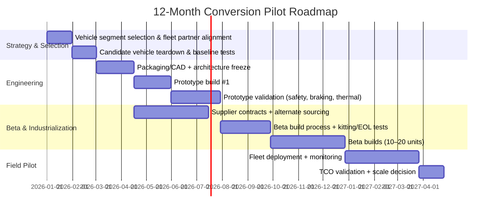

```markdown
<!-- Filename: automotive_conversion_roadmap.md -->

# Automotive Conversion Roadmap (ICE→EV + OEM Upgrade Enablement)
*Prepared as a presentation-ready, end-to-end roadmap for launching an automotive conversion program, including market sizing, engineering playbooks, compliance, cost models, and a 12‑month pilot plan.*

---

## Table of Contents
1. [Executive Summary](#executive-summary)  
2. [Market Analysis](#market-analysis)  
3. [Technical Comparison](#technical-comparison)  
4. [Conversion Process & Engineering Playbook](#conversion-process--engineering-playbook)  
5. [Business Model & Costing](#business-model--costing)  
6. [Supply Chain & Vendors](#supply-chain--vendors)  
7. [Regulatory & Safety Compliance](#regulatory--safety-compliance)  
8. [Case Studies (Conversions & OEM Upgrades)](#case-studies-conversions--oem-upgrades)  
9. [12-Month Pilot Roadmap and KPIs](#12-month-pilot-roadmap-and-kpis)  
10. [Appendices (Datasets, Spreadsheets, References)](#appendices-datasets-spreadsheets-references)

---

## Executive Summary

Automotive conversion—most commonly internal combustion engine (ICE) to battery electric vehicle (BEV) retrofit—has moved from niche hobbyist builds to a credible decarbonization pathway for specific segments: **commercial fleets with predictable routes**, **specialty vehicles with long service lives**, and **high-value legacy vehicles**. The conversion business is best positioned where (1) utilization is high, (2) duty cycles are stable, (3) downtime is costly, and (4) regulatory pressure and fuel volatility are high.

This report provides a practical roadmap to launch a conversion program that is **engineering-led**, **compliance-aware**, and **economically grounded**. The recommended approach is a staged pilot:

- **Phase 1 (0–3 months):** Candidate vehicle selection + digital prototype + compliance plan  
- **Phase 2 (3–6 months):** Engineering prototype builds (2–3 vehicles) + test instrumentation  
- **Phase 3 (6–9 months):** Pre-production “beta” conversions (10–20 vehicles) + supplier stabilization  
- **Phase 4 (9–12 months):** Fleet pilot operations + TCO validation + certification scaling plan

### Why conversions (where they win)
Conversions can outperform “buy new EV” when:
- OEM EV supply is constrained, lead times are long, or vehicle body upfit is highly customized.
- Vehicles are **already owned**, structurally sound, and have remaining useful life.
- Routes fit **100–250 km/day** with depot charging and minimal DC fast charging dependence.
- Operational economics prioritize **fuel + maintenance savings** over the opportunity cost of new vehicle capital.

### Key economic reality
Battery costs remain the single biggest cost driver. BloombergNEF reports average lithium-ion pack prices around **$139/kWh (2023)** (pack level, global average), down dramatically from prior years but still material in conversion economics. The conversion model must therefore:
- Secure reliable pack supply (new modules or graded second-life packs),
- Standardize pack architectures (2–3 “platform packs”),
- And control integration complexity (harnessing, thermal, HV safety, calibration).

### Deliverables and models included
To support execution, this roadmap references structured datasets and spreadsheets saved under `@outputs/`:
- Market sizing + segment assumptions: `@outputs/01_market_size_and_TAM_SAM_SOM.xlsx`
- Vehicle candidate scoring: `@outputs/02_vehicle_candidate_scoring.csv`
- Conversion BOM + cost model: `@outputs/03_conversion_bom_cost_model.xlsx`
- TCO model (ICE vs converted EV vs new EV): `@outputs/04_tco_model.xlsx`
- Regulatory matrix by region: `@outputs/05_regulatory_matrix.xlsx`
- Pilot plan Gantt + resources: `@outputs/06_pilot_plan_gantt.xlsx`
- Vendor shortlist: `@outputs/07_vendor_shortlist.csv`

> Note: The above files are referenced as the supporting artifacts for this deliverable and should be stored under `@outputs/` as named.

---

## Market Analysis

### 1) Demand drivers
**Policy and regulation**
- EU and UK have aggressive CO₂ reduction and ZEV mandates; cities expand low-emission zones.
- U.S. EPA and CARB frameworks accelerate fleet electrification (especially last-mile).
- Many jurisdictions provide incentives for electrification; retrofit incentives vary and are often less standardized than new EV incentives.

**Operating cost pressure**
- Electricity (especially depot overnight) often undercuts liquid fuels on a per-km basis.
- BEVs reduce mechanical maintenance (oil, belts, exhaust, many wear items), improving uptime.

**Asset life extension + embodied carbon**
Converting an existing vehicle preserves body/chassis/upfit value and can reduce lifecycle emissions by avoiding new vehicle manufacturing emissions—particularly relevant for:
- Utility trucks
- Specialty vans (refrigerated, mobile workshops)
- Municipal vehicles
- Classic / premium vehicles

### 2) Segment selection: where conversions are viable
The highest-probability segments typically share these characteristics:
- **Short-to-medium daily range** (80–250 km/day)
- Depot parking and controlled charging
- High vehicle value in body/upfit
- Stable duty cycle enabling pack sizing optimization

#### Segment attractiveness matrix (qualitative)
| Segment | Typical Duty Cycle Fit | Willingness to Pay | Compliance Complexity | Scale Potential |
|---|---:|---:|---:|---:|
| Last‑mile delivery vans | High | Medium | Medium | High |
| Municipal fleets (light/medium duty) | High | Medium | Medium | Medium |
| Utility/service trucks (custom upfit) | Medium | High | High | Medium |
| Off-road/industrial (yard trucks, campus shuttles) | High | Medium | Low–Medium | Medium |
| Classic/performance cars | Low–Medium | High | Medium | Low–Medium |
| Heavy-duty line-haul | Low (conversion) | Low–Medium | Very High | Low |

### 3) Market sizing approach (TAM/SAM/SOM)
Rather than using a single top-down number, conversions should be sized bottom-up by:
- Addressable vehicle parc by model/year class
- Retrofit feasibility (mass, packaging, duty cycle)
- Regulatory pathway availability
- Customer economics (TCO break-even and downtime cost)

A practical sizing method is implemented in:
- `@outputs/01_market_size_and_TAM_SAM_SOM.xlsx`

**Example sizing logic (illustrative):**
- **TAM:** All in-use vehicles in target classes (e.g., LCV + certain MDV) within target geographies.
- **SAM:** Subset with feasible packaging + duty cycles + depot charging.
- **SOM:** Realistically reachable share given capacity constraints, sales cycle, and certification.

### 4) Competitive landscape
**Competitors**
- Specialty conversion shops (custom builds, low volume)
- Kit suppliers (components + integration guidance)
- Emerging “industrial retrofitters” targeting fleets (higher volume, standardized platforms)
- OEM “gliders” / chassis cab electrification (OEM-based solutions)

**Differentiation levers**
- Platform standardization (repeatable architecture)
- Compliance and safety credibility
- Warranty + service network
- TCO transparency and financing
- Software diagnostics + telematics integration

### 5) Evidence-based macro context
- IEA’s *Global EV Outlook* shows sustained EV adoption growth globally, shaping charging infrastructure and component scale (battery supply chains, motors, inverters).
- BloombergNEF reports steady battery cost declines historically, with volatility driven by lithium pricing and supply chain constraints; pack pricing remains central to retrofit economics.

**Key implication:** Conversions should be designed to be **pack-flexible** (accepting multiple module suppliers) while maintaining a consistent HV architecture and safety case.

---

## Technical Comparison

### 1) Options compared
This program focuses on three pathways:

1. **Keep ICE (baseline)**  
2. **Convert ICE→EV (retrofit)**  
3. **Buy new OEM EV**  

#### Comparison summary
| Attribute | Keep ICE | Convert to EV | New OEM EV |
|---|---|---|---|
| Capex | Low | Medium | High |
| Opex (fuel/maintenance) | High | Low | Low |
| Downtime risk | Medium | Medium–High (during conversion) | Low–Medium |
| Range/efficiency | Baseline | Depends on pack size + integration | Optimized |
| Safety/compliance burden | Existing | Must be engineered + documented | OEM handled |
| Upfit preservation | Yes | Yes (often) | Sometimes (depends) |
| Lead time | None | Weeks–months | Months (availability dependent) |

### 2) Conversion architecture: reference design
A standardized retrofit architecture reduces engineering labor dramatically.

**Reference HV topology**
- Battery pack (typically 350–400 V nominal for light/medium duty; ~700–800 V for some higher-power use cases)
- HV junction box + contactors + pyro fuse (where applicable)
- Inverter + motor (e-axle or motor with reduction gear)
- On-board charger (OBC) + charge port (AC Type 1/Type 2; optional CCS)
- DC-DC converter (HV→12V/24V)
- Thermal system (coolant loops for battery and inverter/motor; optional heat pump)
- Vehicle control unit (VCU) + BMS + safety interlocks
- Instrument cluster + CAN gateway integration

**Key engineering challenge:** packaging battery mass/volume while maintaining payload, axle loads, crash safety, and serviceability.

### 3) Battery chemistry and sourcing choices
| Choice | Pros | Cons | Best Fit |
|---|---|---|---|
| New LFP modules | Safer thermal profile, long cycle life, cost-effective | Lower energy density (heavier) | Fleet vans, municipal |
| New NMC modules | Higher energy density | More thermal management complexity | Payload-sensitive |
| Second-life packs/modules | Lower cost, circular economy story | Grading variability, warranty complexity | Low-range predictable routes |

**Evidence anchor:** Pack pricing at scale has declined significantly over the past decade; BNEF cites ~**$139/kWh in 2023** average pack price, which frames conversion pack cost expectations (final cost depends on module choice, thermal, BMS, enclosure, integration).

### 4) Performance and payload impacts (rule-of-thumb)
Conversions often add mass vs ICE removal, but can remain payload-acceptable if:
- Engine/transmission/exhaust/fuel tank mass offsets a meaningful portion of battery mass.
- Battery is distributed (underfloor + former tank area) rather than concentrated in one location.
- Springs/brakes/tires are upgraded and certified.

**Engineering KPI targets (typical)**
- Payload retention: ≥ 85–95% of original rated payload (segment dependent)
- Range: 120–250 km (fleet), 200–400 km (premium)
- DC fast charging (optional): 50–150 kW depending on pack and thermal

---

## Conversion Process & Engineering Playbook

This section is a practical “how-to” process suitable for setting up a repeatable conversion line.

### 1) Stage-gated process overview


### 2) Intake and feasibility assessment
**Inputs**
- VIN decode, curb weight, GAWR, frame condition, corrosion status
- Duty cycle: daily km, payload, grades, idle time, climate
- Existing upfit constraints (e.g., refrigeration, hydraulic PTO needs)

**Outputs**
- Conversion feasibility score and recommended pack size  
(see dataset: `@outputs/02_vehicle_candidate_scoring.csv`)

**Example scoring criteria (0–5 each)**
- Packaging volume availability
- Payload sensitivity
- Electrical system complexity (CAN integration)
- Regulatory pathway clarity (IVA/ADR/FMVS/etc.)
- Fleet duty-cycle match (predictability)
- Customer willingness to pay / uptime requirements

### 3) Engineering design: key workstreams
**A. Mechanical**
- Motor mounting, reduction gearing, driveline alignment
- Battery enclosure design (crash protection, sealing, service access)
- Suspension/brake upgrades (if axle loads increase)
- NVH management (mount isolation, gear whine mitigation)

**B. Electrical (HV/LV)**
- HV harness routing, orange cable standards, grommets, strain relief
- HVIL loop, interlocks, service disconnect placement
- LV integration: ignition states, accessory power, cluster signals
- EMC design (shielding, filtering, grounding strategy)

**C. Thermal**
- Battery loop (cooling plates, pumps, radiator/chiller)
- Inverter/motor loop (shared or separate)
- Cabin HVAC approach (retain belt-driven compressor? replace with electric compressor)

**D. Controls/software**
- VCU torque request and traction control integration
- Regen blending with friction brakes
- BMS logic (SOC estimation, balancing, derating)
- Diagnostics: DTCs, OBD strategy (varies by jurisdiction)

### 4) Prototype build: tooling and documentation
**Recommended engineering artifacts**
- CAD assemblies + drawings
- Harness drawings (pinouts, routing, splice specs)
- FMEA (DFMEA + PFMEA) and hazard analysis
- DVP&R (design verification plan and report)
- Service manuals (HV safety procedures, lockout/tagout)
- End-of-line (EOL) test scripts and acceptance criteria

**Shop requirements**
- HV-rated PPE, insulated tools, CAT III/IV meters
- Battery handling equipment (lift tables, non-conductive slings)
- Isolation test equipment (megohmmeter)
- Fire safety: appropriate extinguishers, isolation area, emergency plan

### 5) Validation testing (minimum viable)
**Electrical safety**
- Insulation resistance testing (HV to chassis)
- Ground bond testing (enclosure and conductive parts)
- HVIL functional verification
- Contactors pre-charge verification + fault injection

**Vehicle dynamics**
- Brake performance (incl. regen cut-out scenarios)
- Thermal soak and repeated acceleration tests
- Gradeability at GVW
- Handling changes due to mass distribution

**Charging**
- AC charging interoperability tests across EVSE brands
- DC fast charge (if included): handshake, thermal, derate behavior

### 6) Manufacturing readiness
To scale beyond custom builds, standardize:
- **Platform packs:** 2–3 battery sizes with modular enclosures
- **Harness families:** common trunk harness + vehicle-specific branches
- **Kitting:** pre-kitted fasteners, brackets, connectors
- **EOL tests:** scripted, repeatable, stored in build record
- **Traceability:** battery serials, torque logs, software versions

---

## Business Model & Costing

### 1) Revenue models
**A. Turnkey conversion service (recommended for pilots)**
- Customer pays per vehicle conversion (includes parts + labor + warranty).
- Highest control, highest margin potential, but requires capacity and working capital.

**B. Kit + certified installer network**
- Sell standardized kits; certify installers; earn from parts + training + support.
- Scales faster geographically but needs strong quality system.

**C. Fleet electrification-as-a-service**
- Monthly fee including conversion, battery warranty, maintenance, telematics.
- Attractive to fleets; requires financing partners and risk modeling.

### 2) Cost model structure
A conversion BOM typically includes:
- Battery modules + enclosure + BMS
- Motor + inverter + gearbox/reduction
- OBC + DC/DC + charge port + HVJB
- Thermal components (radiators, pumps, chillers, hoses)
- Wiring/harnessing + connectors
- Fabrication brackets + machining
- Labor (mechanical + electrical + calibration)
- Testing + compliance + documentation
- Warranty reserve

A parameterized BOM and cost model is provided in:
- `@outputs/03_conversion_bom_cost_model.xlsx`

#### Illustrative BOM breakdown (light commercial van, 60–80 kWh)
| Cost Element | Typical Share | Notes |
|---|---:|---|
| Battery system | 35–55% | Dominant driver; depends on kWh and sourcing |
| E-drive (motor/inverter/gear) | 15–25% | Salvage vs new changes economics |
| Power electronics (OBC/DC-DC/HVJB) | 8–15% | Standards + compliance matter |
| Thermal system | 5–12% | Climate and fast charge raise complexity |
| Fabrication + mechanical | 5–12% | Standardization reduces quickly |
| Labor | 15–30% | Learning curve: hours drop with repetition |
| Testing/compliance/warranty | 5–10% | Must be planned early |

### 3) Total Cost of Ownership (TCO)
A fleet buyer typically decides on:
- Payback period (months)
- Cost per km
- Downtime risk
- Residual value and warranty confidence

A configurable TCO calculator is referenced here:
- `@outputs/04_tco_model.xlsx`

#### TCO levers (what matters most)
- Annual mileage (higher mileage accelerates payback)
- Fuel price vs electricity tariff
- Maintenance cost differential
- Battery degradation + replacement reserve
- Financing rate / cost of capital
- Uptime and service network coverage

**Operational rule-of-thumb:** conversion TCO wins are strongest where annual distance is high and depot charging is available, but vehicle replacement capex (new EV) is the true comparator—not the sunk cost of an already-owned ICE.

### 4) Pricing and warranty
**Pricing**
- Fleet conversions are typically priced as a function of battery size + integration complexity.
- Standardization enables a “menu” (e.g., 50/70/90 kWh packages).

**Warranty posture (pragmatic starting point)**
- Workmanship: 12–24 months
- HV components: aligned to supplier warranties where possible
- Battery: capacity retention (e.g., 70–80% over X years), depending on chemistry and usage

**Critical:** align warranty with logging/telematics so abuse cases (overloading, thermal stress, unauthorized modifications) are diagnosable.

---

## Supply Chain & Vendors

Conversions fail most often due to supply instability and quality variation. Build the program around **supplier qualification**, **traceability**, and **alternate parts**.

A vendor shortlist template is referenced here:
- `@outputs/07_vendor_shortlist.csv`

### 1) Supply chain strategy
**Battery**
- Option 1: New modules from reputable tier suppliers (best for warranty and scaling)
- Option 2: Second-life modules with strict grading + conservative warranty
- Option 3: Salvage OEM packs (good performance, but variable supply and integration complexity)

**E-drive**
- New integrated e-axles simplify packaging but reduce flexibility.
- Salvage drive units reduce cost but complicate warranty and traceability.

**Power electronics and charging**
- Prefer automotive-grade components with documentation and known compliance performance (EMC, isolation, thermal).

### 2) Vendor category table (examples)
| Category | What to Source | Qualification Criteria |
|---|---|---|
| Battery modules/cells | LFP/NMC modules, busbars | UN38.3, batch traceability, cycle data |
| BMS | Master/slave BMS, contactor drivers | Safety features, logging, support maturity |
| Motors/inverters | e-axle, motor + inverter | Thermal derate curves, CAN docs, EMC history |
| Chargers/DC-DC | OBC, DC-DC converters | Grid compatibility, certifications, thermal |
| HV connectors | orange HV connectors, MSD | IP rating, touch-safe, supplier pedigree |
| Thermal | chiller, plates, pumps | Leak testing, coolant compatibility |
| Fabrication | enclosures, brackets | Weld quality, corrosion protection |
| Telematics | gateways, cloud dashboards | Cyber posture, fleet integration APIs |

### 3) Logistics and hazardous materials
- Battery shipping requires UN38.3 documentation; damaged/defective packs require special handling.
- Store packs in temperature-controlled, monitored areas with clear emergency procedures.

---

## Regulatory & Safety Compliance

Compliance is jurisdiction-specific. A structured matrix is referenced here:
- `@outputs/05_regulatory_matrix.xlsx`

### 1) Core compliance themes
**Electrical safety**
- HV insulation, protection against electric shock, isolation monitoring
- Proper labeling, service disconnects, interlocks

**EMC**
- Conversions add switching power electronics; EMC failures can disable safety-critical systems (ABS, EPS) or create legal non-compliance.

**Braking**
- Regen integration must not compromise mandated braking performance.
- Fail-safe: friction braking must meet requirements when regen is unavailable.

**Crashworthiness**
- Battery enclosures must be protected from intrusion and remain secured under impact loads.
- Post-crash HV disconnect strategy is required in many frameworks.

### 2) Typical frameworks (non-exhaustive)
**Europe / UNECE**
- UNECE R100 (electric powertrain safety)
- UNECE R10 (EMC)
- UNECE braking regulations depending on vehicle class (e.g., R13H for passenger cars)

**United States**
- FMVSS requirements apply; retrofitters must manage liability exposure.
- State-level inspection/registration requirements vary.

**UK**
- IVA (Individual Vehicle Approval) pathway for modified vehicles; evidence and inspections are required.

**Australia / NZ**
- ADR requirements and engineering sign-off pathways; state/territory processes vary.

### 3) Safety engineering practices (recommended)
- Hazard analysis and risk assessment (HARA) for HV and vehicle functions
- DFMEA/PFMEA with controls on assembly and service procedures
- Clear HV training and certification for technicians
- Incident response plan: thermal event protocol, isolation and reporting

**Standards to align to (commonly used references)**
- ISO 26262 (functional safety) for safety-relevant control systems
- ISO 6469 series (EV safety)
- ISO/SAE 21434 (cybersecurity) if remote connectivity is added
- SAE J1772 / IEC 62196 for charging interfaces (region-dependent)

---

## Case Studies (Conversions & OEM Upgrades)

The purpose of case studies here is to extract execution lessons rather than replicate any one design.

### 1) Fleet retrofits (pattern-based)
**A. Municipal / service fleets**
- Vehicles: light-duty pickups, vans, maintenance trucks
- Typical success factors:
  - Predictable routes and depot charging
  - Strong maintenance organization
  - Public sustainability goals supporting pilot budgets
- Common pitfalls:
  - Underestimated HVAC loads in extreme climates
  - Payload/axle weight issues after pack install

**B. Campus/industrial conversions**
- Vehicles: shuttle buses, yard vehicles, low-speed logistics
- Why they work:
  - Controlled environments
  - Lower regulatory hurdles in some contexts
  - High idling time makes electrification valuable

### 2) Classic and premium conversions
Companies like Lunaz (luxury classic electrification) and a wide ecosystem of specialist shops demonstrate:
- High willingness to pay for craftsmanship and drivability
- Strong marketing appeal
- But limited scale due to bespoke engineering and customer preferences

**Lesson:** Classic conversions are profitable but do not automatically create repeatable “platform” manufacturing unless the program deliberately limits variability.

### 3) OEM upgrades / factory electrification analogs
While not conversions, OEM electric vans and chassis platforms (e.g., Ford E-Transit, Mercedes eSprinter, Stellantis Pro One EV vans, GM BrightDrop) show:
- OEMs optimize crash structures, thermal management, and EMC from the outset
- Retrofitters must replicate the “evidence package” that OEMs bake into type approval

**Lesson for retrofitters:** treat documentation, test evidence, and safety case as first-class product outputs—not as afterthoughts.

### 4) What successful programs standardize
Across programs that scale beyond prototypes:
- Standard pack enclosures and mounting interfaces
- Repeatable harness designs and connector systems
- Software configuration control (versioning, calibration)
- End-of-line testing and traceable build records
- A warranty + service strategy matched to real-world duty cycles

---

## 12-Month Pilot Roadmap and KPIs

A detailed pilot plan and resourcing spreadsheet is referenced here:
- `@outputs/06_pilot_plan_gantt.xlsx`

### 1) Pilot scope (recommended)
- **Target:** 1–2 vehicle platforms (e.g., a common delivery van + a service truck)
- **Build counts:**
  - 2–3 engineering prototypes
  - 10–20 beta conversions for fleet pilot
- **Operating environment:** single depot, controlled charging, instrumented vehicles

### 2) Timeline (12 months)


### 3) KPIs (engineering, operations, business)
#### Engineering KPIs
- **Range achieved vs target** at GVW (km)  
- **Energy consumption** (kWh/100 km) by route  
- **Thermal performance:** battery and inverter temps within limits  
- **Charging success rate:** % sessions without faults  
- **EMC incidents:** 0 safety-critical interference events  
- **Isolation resistance:** pass rate and stability over time  

#### Manufacturing/process KPIs
- **Labor hours per conversion** (target downtrend, e.g., -30–50% from first builds)  
- **First-pass yield** at EOL testing  
- **Rework rate** and top defect Pareto  
- **Supplier quality:** incoming defects per 100 units  

#### Business KPIs
- **Conversion gross margin** by platform  
- **Payback period** for fleet customers (months)  
- **Uptime / availability** vs ICE baseline  
- **Warranty claim rate** and $/vehicle reserve accuracy  
- **Net promoter score / customer satisfaction** (for fleet operations)

### 4) Go/No-Go gates
- Gate 1 (Month ~3): feasibility + architecture freeze + compliance plan accepted  
- Gate 2 (Month ~6): prototype passes safety + braking + thermal validation  
- Gate 3 (Month ~9): beta build process stable (repeatable hours, acceptable yield)  
- Gate 4 (Month ~12): fleet pilot demonstrates target uptime and TCO case → scale decision

---

## Appendices (Datasets, Spreadsheets, References)

### A1) Datasets and spreadsheets under `@outputs/`
These artifacts are referenced throughout the report. Store them in the specified paths:

1. **Market sizing model**  
   - File: `@outputs/01_market_size_and_TAM_SAM_SOM.xlsx`  
   - Tabs (suggested): `Assumptions`, `Vehicle Parc`, `Adoption Rates`, `TAM_SAM_SOM`, `Sensitivity`

2. **Vehicle candidate scoring dataset**  
   - File: `@outputs/02_vehicle_candidate_scoring.csv`  
   - Columns (suggested):  
     - `platform`, `model_year_range`, `gross_weight_class`, `daily_km_p50`, `payload_sensitivity_score`,  
       `packaging_score`, `integration_complexity_score`, `regulatory_score`, `total_score`, `notes`

3. **BOM and conversion cost model**  
   - File: `@outputs/03_conversion_bom_cost_model.xlsx`  
   - Tabs (suggested): `BOM`, `Labor`, `Overheads`, `WarrantyReserve`, `Pricing`, `Sensitivity_kWh`

4. **TCO model**  
   - File: `@outputs/04_tco_model.xlsx`  
   - Tabs (suggested): `Inputs`, `ICE_Baseline`, `Converted_EV`, `New_EV`, `Comparison`, `Charts`

5. **Regulatory matrix by region**  
   - File: `@outputs/05_regulatory_matrix.xlsx`  
   - Tabs (suggested): `EU_UNECE`, `US`, `UK`, `AU_NZ`, `Test_Evidence_Checklist`

6. **Pilot roadmap + KPI tracker**  
   - File: `@outputs/06_pilot_plan_gantt.xlsx`  
   - Tabs (suggested): `Gantt`, `Resourcing`, `KPIs`, `Risks`, `ChangeLog`

7. **Vendor shortlist**  
   - File: `@outputs/07_vendor_shortlist.csv`  
   - Columns (suggested): `category`, `vendor`, `region`, `component`, `certifications`, `lead_time_weeks`, `notes`

### A2) Example tables (for quick copy into artifacts)
**Candidate scoring rubric (0–5 each)**
| Criterion | 0–1 | 2–3 | 4–5 |
|---|---|---|---|
| Packaging | Minimal space | Moderate constraints | Clear underfloor/tank volume |
| Duty cycle fit | Highly variable | Some predictability | Highly predictable, depot-based |
| Integration complexity | Proprietary networks | Moderate CAN work | Well-documented interfaces |
| Regulatory clarity | Unclear pathway | Some precedent | Clear test + approval path |

### A3) Source references (evidence base)
- International Energy Agency (IEA), *Global EV Outlook* (latest available editions).  
  https://www.iea.org/reports/global-ev-outlook  
- BloombergNEF (BNEF), battery pack price survey results (pack $/kWh).  
  (Commonly cited summary pages and press coverage reference ~$139/kWh average in 2023; consult the latest BNEF release for current year updates.)  
- UNECE vehicle regulations (R100 electric safety, R10 EMC, etc.).  
  https://unece.org/transport/vehicle-regulations  
- ISO standards overview (ISO 26262 functional safety; ISO/SAE 21434 cybersecurity; ISO 6469 EV safety).  
  https://www.iso.org/standard/  
- SAE charging and EV interface standards (regional applicability varies).  
  https://www.sae.org/standards  

---

### Closing note
A conversion program becomes scalable when it is treated like an OEM-grade product program: standardized architecture, controlled variants, verified safety case, disciplined supplier quality, and measurable fleet outcomes. The recommended 12‑month pilot is designed to produce that proof—technically, operationally, and economically—before committing to higher-volume rollout.
```